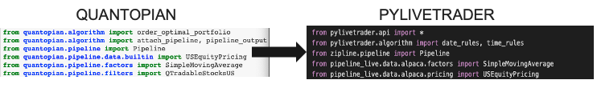
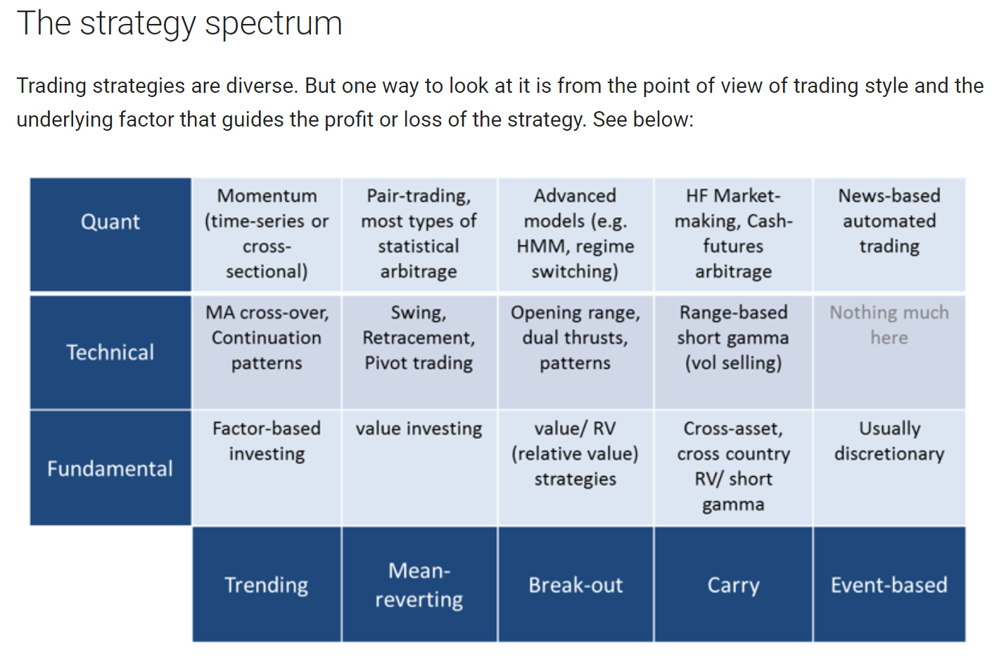

# Quantitative Trading System
## NU Fintech Bootcamp: Project 1

## Project Overview
Our NU Fintech team built a functional quantitative trading system that implements strategies researched and tested in Quantopian. Those strategies are then executed in Alpaca- the commission-free stock trading API. 

## Purpose
The purpose of this project is to successfully build a foundational quantitative trading system that can be evolved upon as our fintech class continues. The goal is to test and implement quantitative strategies aimed toward maximal risk-adjusted returns in the least amount of time possible. 

## Business Significance
    - Saves time by using a simpler process going from research to execution
    - Saves time and increases probability of returns by allowing researchers and traders to focus on iterating on their talent opposed to spending time on development and data prep
    - Gives independent quantitative traders the ability to invest/trade on their own.
    
## Costs
    - Time spent on factor research
    - Time spent building algorithms
    - Time spent translating quantopian algorithms to a format that can be executed in Alpaca
    - Normal costs of investing, all the tools involved are free

## Tools
[Alpaca](https://alpaca.markets/)  
[Python Library-pylivetrader](https://github.com/alpacahq/pylivetrader)  
[Quantopian Notebooks](https://www.quantopian.com/notebooks)  
[Quantopian Algorithms](https://www.quantopian.com/algorithms)  
[Visual Studio](https://visualstudio.microsoft.com/)  
[Jupyter Lab](https://jupyterlab.readthedocs.io/en/stable/)  

## Methodology
1. Quantitative Research Notebook in Quantopian
2. Backtest Pipeline/Algorithm 
3. Translate quantopian algorithm to pylivetrader
4. Connect Alpaca account to algorithm
5. Run algorithm in command Line
6. Monitor Results on Alpaca Interface

## Project Timeline
    - June 2: Start Project
    - June 13: First Draft of Project completed
    - June 16: Final Draft of Project completed, Test System in live environment
    - June 17: Test System in live environment
    - June 18: Presentation
    - After: can be iterated on as bootcamp continues

## Project Team
    - NU FINTECH
        - Javier Mendez, Grant DePalma, Dave Rea, Subbaiah Kotha
    

## Repository Introduction
This GitHub repository contains the code for an algorythm that can be used in quantopian. The returns in the algorythm in its current state are not as optimal as possible, but the structure for an investment strategy that involves both longs and shorts that is done with technical analysis of common financial metrics is there to be modified according to the desired positions of the user. Using simple metrics like Closing Price, Simple Moving Average, and Historical Returns, we were able to outperform "common returns" on Quantopian, which means that we were able to outperform others who were using these same "factors" in their algorythms. In the future, this can be expanded upon to use much more complicated analysis, as well as optimized with machine learning. 

Additionally, we designed this to be compatible with Alpaca, a trading platform that allows you to use Python/Quantopian/Pandas to create automated trading strategies. This was done with pyvlivetrading to help make the transition as smooth as possible to Alpaca. While our Quantopian algorythm executes weekly, the Alpaca one is set to run daily to demonstrate its capabilities. 

## Code

*  In the Algo Folder:
  
    * long_short_algo is a simple "Long/Short" strategy that can be used in Quantopian, for testing/research purposes.
    
    * Project1Final is the backtesting code in Quantopian.
    
    * Algo_Final_Pylivetrader is the final code for the algorythm as used in Alpaca. Implemented daily rather than weekly. 

## How this is useful to you:

If you are interested in using an algorythm to develop an investment strategy, playing with this code in quantopian can help you better understand how to use it as a way to backtest any given strategy. Additionally, if you are looking for guidance as to how to transfer your quantopian strategy to Alpaca, there is code for how we were able to do that as well in this repository. 

Most importantly, this is a way to demonstrate how useful Quantopian can be for someone trying to develop an investment strategies with little knowledge of how to use API's. During our time on this project we were able to focus much more on the trading and finance aspect of the strategy, and less on the gathering of the data--which I am sure can be greatly appreciated by all those who work in Data Science/Analysis. 

We followed these steps in order to create the algorythm and then move it over to Alpaca. 

### Version 1.0.0

Live Date: June 18, 2020

Team Goals:
1. In groups of 2, develop the Alpaca and Quantopian aspects of the project for the first week of the project. 
2. Meet halfway on June 13 after structure has been created to finalize the structure and begin testing to optimize results in an attempt to beat common returns. 
3. On June 16, make finishing touches and final changes to ensure profitability and over-performance relative to other algorythms using similar factors. 

## Results

## Alpaca Implementation
### Setup Requirements
*  Python 3.6 and the Pylivetrader package 
(*Pylivetrader is Python's live algorithm implementation package necessary for translating Quantopian libraries for live and paper trading via Alpaca*)
* Pylivetrader can be installed one of two ways (and must be installed in Python v3.6):
1. Pyenv and virtualenv (for Mac users) installation and steps necesssary to activate a virtual environment in Python3.6. Further documentation found here: https://github.com/pyenv/pyenv-virtualenv/blob/master/README.md
2. Anaconda (note that any work done in an Anaconda environment requires code to be copied and pasted into a fresh .py via VS Code or the like in order to run algorithms via the command line)
* Alpaca account registration and API keys
### Quantopian to Pylivetrader Translation
* Quick link to Quantopian to Alpac migration documentation found here: https://github.com/alpacahq/pylivetrader/blob/master/migration.md
* Additional Call-outs:
1. Quantopian code is developed in Python 2 but offers a simple one-click solution to 3.5 within the UI prior to copying into an external Python file
2. Quantopian optimize functions are not readily mimicked in external Python environments
3. Alpaca uses Polygon as their fundamental data source so additional translation from Quantopian's Morningstar to Polygon must be performed and as of 6.17.20 requires a funded Alpaca account even for Paper simulation
* Example Visual of Package translation from Quantopian to Pylivetrader

* External environments will often not kick back code errors so as a best practice, ensure your translated code runs back within the Quantopian environment to ensure execution when running in a live or paper environment via Alpaca
* Note that Blueshift (https://blueshift.quantinsti.com/) offers a considerably more turnkey path to execution via Alpaca but a trimmed down data provider and research offering relative to Quantopian
### Algorithm Launch
* Running from the command line instructions found here: https://github.com/alpacahq/pylivetrader/blob/master/README.md and additional troubleshooting issues found here: https://github.com/alpacahq/pylivetrader/issues
* As of 6.17.20, Pylivetrader must be restarted at least once every 24 hours but I found that to be considerably more frequently for this exercise
* There's currently no clean way to parse out multiple algorithms running concurrently within the Alpaca UI

## Areas to improve
    - Potential clunkiness  in pylivetrader. Consider translating to blueshift instead.
    - Limited by Market Data and availability. Find workarounds. 
    - Add Machine Learning techniques to finding quantitative relationships
    - Create a performance analysis notebook to analyze live results 
    - Create automated email reports with performance analysis

## Creative Resources

)

## Resources: 
[Article on Multi Factor Small Beta](https://www.quantopian.com/posts/multi-factor-smart-beta-strategy-you-can-actually-use-with-confidence)  

[How to put a Quantopian Pipeline into Alpaca](https://alpaca.markets/docs/alpaca-works-with/quantopian-to-pipeline-live/)  
